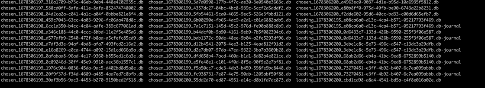

WIP  
*Not ready for PRs yet*

### Install
```
pip install turbo-queue
```

#### Updates:
- added timer to clear out slow batches
- cleanup class to clear out leftover events from restart
  - will ensure events still on disk are reloaded into the queue to be sent
- standardized naming convention of the queue files
- added troubleshooting steps

#### Todo:
- improve logging
- improve documentation
- examples
- process specific connectors

# Turbo Queue

Turbo Queue was designed to improve performance in situations where the Python Multiprocessing Queues is used.  We found that as the number of processes subscribed to a single Multiprocessing Queue increased, the performance on the processes decreased.  This appeared to be due to contention, as the various processes are locking/unlocking the queue to load/get data.  Turbo Queue is used in place of the Multiprocessing Queue, allowing you to create multiple subprocesses that share a queue.

### Use Case

Our use case involved pulling data from a Kafka topic, running CPU intensive operations to further process the data, and then pushing it back into another Kafka topic.  We were processing several billion events each day.

### Solution
Our solution was to develop the Turbo Queue class.  It is a shared nothing "queue" that uses the file system to provide the basis for coordination between the process.  We use an agreed upon set of rules (as defined in the class) to create and manage files to store and process the data.  SQLite is used a high-performance file storage format.  File names (and re-naming) are used as the control mechanisms.  In our use case we work in batches of data, and that is utilized here as well.  We allow tuning of the batch size (which equates to the rows in the SQLite file) for optimal performance.  A side benefit of the shared nothing approach allows entirely seperate applications (not just sub-processes) to use the queue.

### Results
Before Turbo Queue, using the built-in Multiprocessing Queue resulted in deminishing returns with 3 or more processes.  While performance increased with each process, the throughput was not well correlated to the number of processes.  
  
However, with Turbo Queue, we were able to max out our processors on a single system(40+) with a substantial throughput increase.  We actually began to hit limitations with our network and Kafka stack.  We were able to reduce our requirements from 40 python applications (running 2 subprocesses each), to 2 python apps with 30 subprocesses.

### Will this help you?
YMMV.  This worked well for our use case: CPU intesive processes, moving large volumes of data to and from Kafka, and CPU dense hardware.


# Quickstart:
A very basic example:  

```
import turbo_queue

queue_name = 'data_in'
root_path = '/path/to/queue'

### cleanup queues from pervious restarts
clean_turbo_queue = turbo_queue.startup()
clean_turbo_queue.queue_name = queue_name
clean_turbo_queue.root_path = root_path
clean_turbo_queue.on_start_cleanup()

### enqueue data  
enqueue = turbo_queue.enqueue()
enqueue.queue_name = queue_name
enqueue.root_path = root_path
enqueue.max_ready_files = 5
enqueue.max_events_per_file = 1000
enqueue.start()

enqueue.update_enqueue_active_state()
while enqueue.enqueue_active:
  data = """{"data":"add_to_queue"}"""
  enqueue.add(data)
  enqueue.update_enqueue_active_state()
  # update_enqueue_active_state needs to be run at some frequency
  # if the number of ready files exceeds the max, the state will will be set to False
  # this is the mechanism used to address downstream backup in the queue

### Dequeue data
dequeue = fast_queue.dequeue(1)
dequeue.queue_name = queue_name
dequeue.root_path = root_path
get_data = dequeue.get()
data = next(get_data)
while data:
    data = next(get_data)
# data = None when the queue is currently empty
# call next(get_data) again to check the queue for more data
```

### How it works

#### Enqueue - loading data into a queue
  
A process begins using the enqueue class to load data into the "queue".  The "queue" is made up of files on disk.  The files are batches of data.  When the process has **filled** a batch, either by reaching the maximum items for a batch or by timeout (both configurable), the batch is "rolled" to be made "ready" to a dequeue process to use, and a new batch file is created and filled.

#### Dequeue - unloading data from a queue
  
A process begins using the dequeue class to unload data from a "queue".  The "dequeue" process begins by scanning the chosen queue folder for any "ready" files, which are "batches" of data.  If one is found, it takes ownership of the file to ensure another process doesn't use it.  Once owned (by a renaming process) the data items are "yielded" to the calling process.  When the batch is exausted, the file is deleted, and the dequeue process begins again to look for any ready batches.

#### File naming steps:

1 - Enqueue creates a new, unique file for a batch of data:
```
loading_<epoch_time>_<uuid>.db
```
2 - Enqueue has filled the batch, and renames it to ready:
```
#rename:
loading_<epoch_time>_<uuid>.db
# to:
ready_<epoch_time>_<uuid>.db
```
3 - Enqueue restarts the process, and creates a new, unique file for a batch of data  

4 - Dequeue searches for files named ready_*.  When one is chosen, it is renamed to be used exclusively by the process:  
```
# rename:
ready_<epoch_time>_<uuid>.db
# to:
chosen_<epoch_time>_<uuid>.db
```
5 - When dequeue has yielded all of the data in the batch, the file is deleted, and Dequeue looks for the next ready file.

### Monitoring
You can monitor the queues on disk by watching the queue folder:
```
# from the queue folder
# update every 1 second, display in multiple columns if possib;e
watch -n 1 ls -C
```
A sample view of the queue folder:

In this sample, we are watching an enqueue from a Kafka topic, and a dequeue to a third party API:
- The enqueue function is running in 6 processes
  - This is noted by the "loading" files
  - Any missing "loading" files (from a total of 6) of the loading processes is currently rolling over it's batch
- The dequeue function is runing with 120 processes
  - This is noted by the "chosen" files
  - Only the active ones are seen, much less then 120
  - This is ideal as there are ample processes available in the event the enqueue rate increases
    - For example, in the static view below, there are 18 chosen files, so the current rate is 3 to 1, where the 6 enqueue functions (Kafka) are able to keep 18 (send to API) functions full
- Two batches are waiting to be picked up in the static view
  - This is noted by the 2 "ready" files
  - Immedaitely after this screenshot, those files were selected by a dequeue process, and renamed accordingly

Live view updated every second:


A static view of the queue folder:
```
chosen_1678299438_2beeab37-297d-4e11-ac19-c46ca1a93c23.db  chosen_1678299439_37a3780e-1d92-4777-8569-814cd73c084f.db  loading_1678299439_1669d269-4068-4731-a3b1-ef73f280cc16.db
chosen_1678299438_4a052e83-a92b-48b4-908c-b3cc2856e4ee.db  chosen_1678299439_3c793ed4-b636-4117-88ea-86cf133d4540.db  loading_1678299439_696f8103-8ece-43c9-89ff-e2bacf55fb61.db
chosen_1678299438_4ece8d02-dc07-400e-9724-3c0a83d27b2c.db  chosen_1678299439_56bc1950-8f1c-4e1d-b59e-98e744c4220b.db  loading_1678299439_6ff80f4d-105f-4640-99bf-84719b4251ed.db
chosen_1678299438_5c89a70a-3e89-4df6-a84b-dc97cd327048.db  chosen_1678299439_56c05fb2-ff94-429e-bd4b-5e94656fa226.db  loading_1678299439_7579c725-b096-44e5-8680-a8aecedf9f60.db
chosen_1678299438_ebd74f0b-8e54-4d9f-bc2a-251fa98d675a.db  chosen_1678299439_738b4cd8-b4fe-44b5-bb18-940edd936c25.db  loading_1678299439_97c8c09d-d227-4932-ac3e-86f62f3101da.db
chosen_1678299438_f9d6f6ef-96ce-4127-88aa-8ddfae608e7d.db  chosen_1678299439_a71294ac-569b-46a0-a49c-b272b6402496.db  ready_1678299439_0dceb957-4fb1-4661-920d-2ae848ac1a5b.db
chosen_1678299438_fc02ae88-9296-4caa-8da7-ba2e5b939c1f.db  chosen_1678299439_b718b161-6675-4fdc-a8d6-14e38e62c90e.db  ready_1678299439_20dd1f38-c5b2-4c13-b47e-d60cce6563a3.db
chosen_1678299439_0601bab6-87c9-43aa-86c6-eb023000d7d1.db  chosen_1678299439_c946f4ba-3637-43dd-93ed-853d7f9d4cea.db
chosen_1678299439_1d544ff3-d2c6-45d7-b7db-68ada0f8c875.db  chosen_1678299439_d9dc14a5-8452-48a3-bbc5-9c1ad9310ede.db
```  
