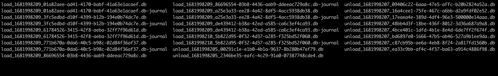

# How it works

*wip - incomplete*

## Enqueue
- Loading data into a queue
  
A process begins using the enqueue class to load data into the "queue".  The "queue" is made up of files on disk.  The files are batches of data.  When the process has **filled** a batch, either by reaching the maximum items for a batch or by timeout (both configurable), the batch is "rolled" to be made "ready" to a dequeue process to use, and a new batch file is created and filled.

## Dequeue
- Unloading data from a queue
  
A process begins using the dequeue class to unload data from a "queue".  The "dequeue" process begins by scanning the queue folder for any "ready" files, which are "batches" of data.  If one is found, it takes ownership of the file to ensure another process doesn't use it.  Once owned (by a renaming process) the data items are "yielded" to the calling process.  When the batch is exausted, the file is deleted, and the dequeue process begins again to look for any ready batches.

## File naming steps
The inner workings of the management of data is based around file names.  These steps are handled by the Turbo Queue class, and are provided here to give a better understanding of the process, particularly if you want to view the queue folder to understand what is occuring.  Planned future releases will have monitoring capabilities.  Until then, the queue can be observed at the command-line (see below)

File name convention:  
```
<status>_<create_timestamp>_<unique_id>.db
```

#### Start
A process is running with an Enqueue class. It adds data to the queue via the **add** method.

#### 1 - Enqueue creates a new, unique file for a batch of data:
```
loading_<epoch_time>_<uuid>.db
```
... and the data is added to the file (batch).  The process continues to add data via the **add** method.

Eventually, the batch is full (when size = max_events_per_file) ...

#### 2 - Enqueue has filled the batch.  It renames the file's status from 'loading' to 'ready':
```
#rename:
loading_<epoch_time>_<uuid>.db
# to:
ready_<epoch_time>_<uuid>.db
```
#### 3 - Enqueue is done with this batch.  It returns to Step 1 when **add** is called again.

Another process is running with a Dequeue class, of which:

#### 4 - Dequeue searches for files named ready_*. When one is chosen, it is renamed to be used exclusively by the process. It renames the file's status from 'ready' to 'unload': 
```
# rename:
ready_<epoch_time>_<uuid>.db
# to:
unload_<epoch_time>_<uuid>.db
```

The Dequeue class yields each data item to the process.

#### 5 - When dequeue has yielded all of the data in the batch, the file is deleted.  Dequeue returns to step 4, and looks for the next available ready file.

### Monitoring
You can monitor the queues on disk by watching the queue folder:
```
# from the queue folder
# update every 1 second, display in multiple columns if possib;e
watch -n 1 ls -C
```
A sample view of the queue folder:

In this sample, we are watching an enqueue from a Kafka topic, and a dequeue to a third party API:
- The enqueue function is running in 6 processes
  - This is noted by the "loading" files
  - Any missing "loading" files (from a total of 6) of the loading processes is currently rolling over it's batch
- The dequeue function is runing with 120 processes
  - This is noted by the "unload" files
  - Only the active ones are seen, much less then 120
  - This is ideal as there are ample processes available in the event the enqueue rate increases
    - For example, in the static view below, there are 18 unload files, so the current rate is 3 to 1, where the 6 enqueue functions (Kafka) are able to keep 18 (send to API) functions full
- Two batches are waiting to be picked up in the static view
  - This is noted by the 2 "ready" files
  - Immedaitely after this screenshot, those files were selected by a dequeue process, and renamed accordingly

Live view updated every second:

